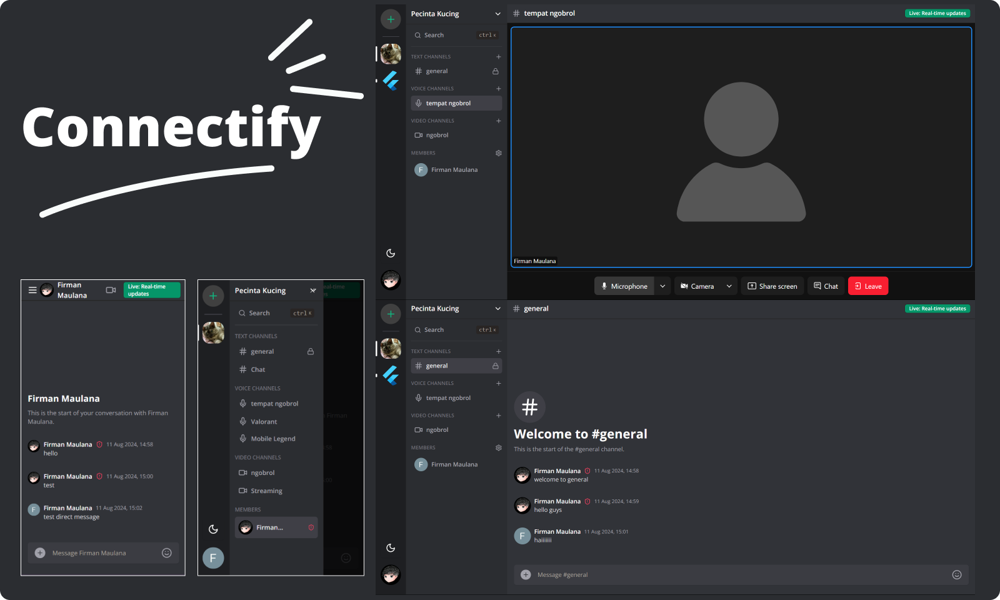

# CONNECTIFY (DISCORD CLONE)

## Overview



> Video Demo:

https://github.com/user-attachments/assets/fd4aa20d-8f33-4505-bee8-5ea3f603ce62

> Key Features:

- Real-time messaging using Socket.io
- Send attachments as messages using UploadThing
- Delete & Edit messages in real time for all users
- Create Text, Audio and Video call Channels
- 1:1 conversation between members
- 1:1 video calls between members
- Member management (Kick, Role change Guest / Moderator)
- Unique invite link generation & full working invite system
- Infinite loading for messages in batches of 10 (@tanstack/query)
- Server creation and customization
- Beautiful UI using TailwindCSS and ShadcnUI
- Full responsivity and mobile UI
- Light / Dark mode
- Websocket fallback: Polling with alerts
- ORM using Prisma
- MySQL database using Planetscale
- Authentication with Clerk

## Getting started

1. Clone this repository:

```
git clone https://github.com/finma/discord-clone.git
```

2. Install npm dependencies:

```
npm install
```

3. Copy env (fill out the necessary information)

```
cp .env.example .env
```

- For clerk, go to [clerk.com](https://clerk.com/), create account, and create application
- For livekit, go to [docs.livekit.io/realtime](https://docs.livekit.io/realtime/) developer, create account, and application

4. Generate and migrate prisma

```
npx prisma generate
npx prisma db push
```

5. Start app

```
npm run dev
```

The app is now running, navigate to http://localhost:3000/ in your browser to explore its UI.
